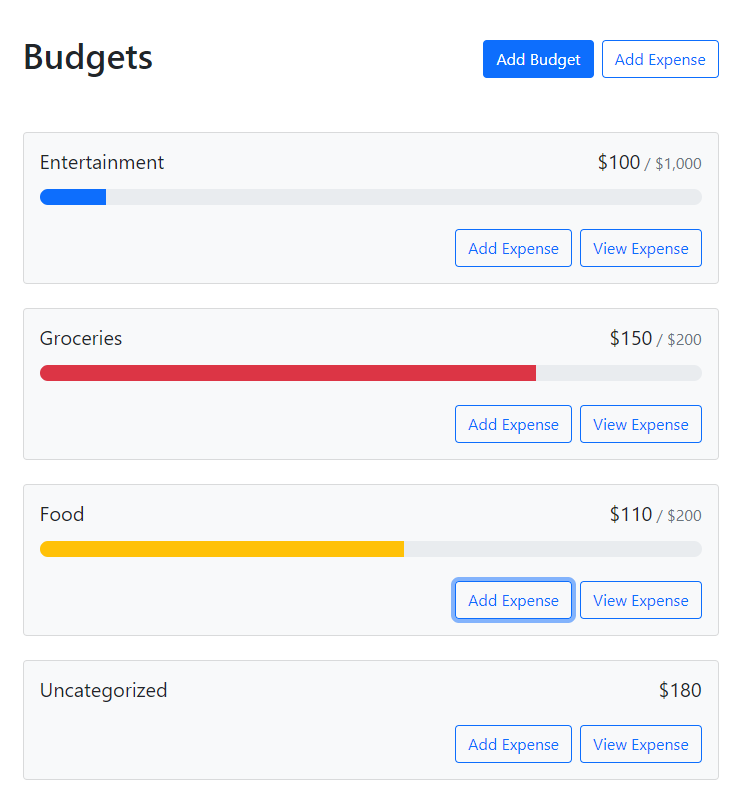

# React Budget App

This project is created by kyle owner of web-dev simplified youtube channel. I have seen his video and practised for improving my react skill as a beginner dev. This project really help me to think in react and use hooks.

## Demo

Insert gif or link to demo

## Lessons Learned

-   useState Hook
-   context api
-   local storage API
-   custom hook
-   Intl.NumberFormat function
-   basic use of react-bootstrap
-   filter mathod

## Screenshots

## Tech Stack

**Client:** HTML, CSS, Javascript, React

## 🚀 About Me

I'm a front-end developer with backend knowledge.

## 🛠 Skills

**Front-end** : Javascript, React, Next.js, HTML, CSS, Bootstrap, Tailwind, SASS, SVG, GSAP

**Aditional Backend** : Node.js, Express.js, MongoDB, MySQL

## Acknowledgements

-   [How To Create A Budget App With React](https://www.youtube.com/watch?v=yz8x71BiGXg)
